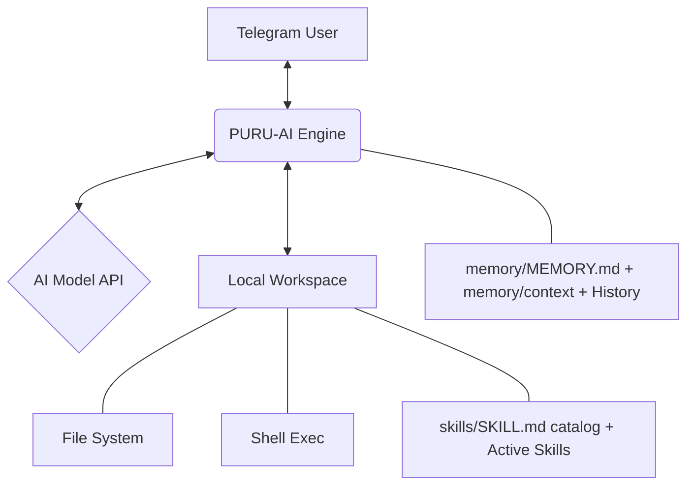

# 🤖 PURU-AI

[](https://golang.org/)
[](LICENSE)
[](https://github.com/purujawa06-bot/PURU-AI/pkgs/container/puru-ai)

**PURU-AI** is a lightweight, high-performance AI assistant for Telegram, engineered in Go. It seamlessly bridges OpenAI-compatible intelligence with a robust local execution engine, providing a powerful, self-hosted workspace operator.

---

## ✨ Key Highlights

- ⚡ **Minimalist & Fast** — Single Go binary with a tiny footprint. No heavy runtimes.
- 🛠️ **Local Tool Intelligence** — Native file operations, shell execution, and web navigation.
- 🧠 **Smart Context Management** — Long-term memory via `memory/MEMORY.md` and automated history summarization into `memory/context/`.
- 🧩 **Skills** — Picoclaw-style `skills/*/SKILL.md` catalog (metadata only in the prompt; the agent reads bodies via `read_file`). Builtins `find-skills` + `skill-creator` + `puruclaw-configure` are seeded on first run; list more skills in `AGENTS.md` frontmatter (`skills: [...]`) to inject them as Active Skills.
- 🔄 **Async Process Control** — Manage long-running background tasks with real-time polling and termination.
- 🔒 **Security First** — Granular workspace restrictions and memory-capped execution.
- 🐳 **Cloud Ready** — Pre-configured for Docker and GitHub Container Registry (GHCR).

---

## 🏗️ Architecture



### Workspace layout (picoclaw-style)

```text
<workspace>/
  AGENTS.md                  # agent identity (AGENT.md accepted as legacy alias)
  SOUL.md                    # personality and values
  USER.md                    # user profile
  memory/MEMORY.md           # long-term memory, written by the agent
  memory/context/*.md        # conversation summaries, system-managed (newest 20)
  skills/find-skills/SKILL.md  # builtin: discover + install new skills via skills.sh directory
  skills/skill-creator/SKILL.md # builtin: author new skills
  skills/puruclaw-configure/SKILL.md # builtin: answer config questions from example.config.json on main
  skills/<skill>/SKILL.md    # installed skills
```

Activate skills per request with `AGENTS.md` frontmatter (bodies injected as Active Skills):

```yaml
---
skills: [find-skills]
---
```

Disable skills via `config.json`: `"skills_mode": "off"` drops every skill section from the prompt; `"custom"` with `"skills_allow": [...]` restricts to the allowlist (picoclaw turn-profile-like). Removing a name from frontmatter or deleting `skills/<name>/` also deactivates it.

---

## 🚀 Getting Started

### Install via npm (easiest, no web server)

```bash
npm i -g @rikipurpur/puru-ai
puru setup        # wizard → writes ~/.puru/config.json
puru gateway      # run the Telegram bot (long-polling, no /health by default)
puru gateway --health --port 8080   # opt-in health check for Docker/VPS
puru chat "halo"  # local debug without Telegram
```

> The npm package downloads the prebuilt `puru` binary from GitHub Releases
> on postinstall (linux/darwin/windows × amd64/arm64, plus linux/arm untuk
> Termux Android 32-bit). Binaries are built
> automatically by the manual **Release** workflow (`verify → tag →
> build-binaries + docker → GitHub Release → npm publish`).

### Termux (Android)

```bash
pkg install nodejs
npm i -g @rikipurpur/puru-ai
puru setup
puru gateway
```

### Deploy with Docker (Recommended)

```bash
# Option A: inline JSON via CONFIG env (no volume needed for config)
docker run -d \
  --name puru-ai \
  -e CONFIG='{"telegram_bot_token":"your_token_here","model":{"base_url":"https://api.openai.com/v1","api_key":"sk-...","model":"gpt-4o-mini"},"workspace":"/root/.puru/workspace"}' \
  -v puru-data:/root/.puru \
  ghcr.io/purujawa06-bot/puru-ai:latest

# Option B: classic file / single envs
docker run -d \
  --name puru-ai \
  -e TELEGRAM_BOT_TOKEN="your_token_here" \
  -v puru-data:/root/.puru \
  ghcr.io/purujawa06-bot/puru-ai:latest
```

> `CONFIG` = full `config.json` as inline JSON (same shape as `example.config.json`).
> Precedence: `CONFIG` > `--config` file > `PURU_CONFIG` > default `~/.puru/config.json`.

### Local Build

1. **Clone & Build:**
   ```bash
   git clone https://github.com/purujawa06-bot/PURU-AI.git
   cd PURU-AI
   go build -o puru-ai .
   ```

2. **Configure:**
   ```bash
   cp example.config.json config.json
   # Edit config.json with your API keys and workspace path
   ```

3. **Run:**
   ```bash
   ./puru-ai --config config.json
   ```

---

## 🛠️ Capability Suite

| Category | Tool | Description |
| :--- | :--- | :--- |
| **File System** | `read`, `write`, `edit`, `ls` | Precise file manipulation with fuzzy matching support. |
| **Execution** | `exec` | Run blocking or background commands with RAM limits. |
| **Web** | `search`, `fetch` | Real-time web search and content extraction. |
| **Telegram** | `sendfile`, `getuser` | Direct interaction with Telegram's API for file sharing. |
| **Runtime** | `get_env` | System telemetry (OS, Arch, Go version, Memory). |
| **Schedule** | `schedule` | Picoclaw cron-like tasks: once, every, daily, cron (default Asia/Jakarta). |

---

## ⚙️ Configuration

| Key | Type | Description |
| :--- | :--- | :--- |
| `telegram_bot_token` | `string` | Your Telegram Bot API token. |
| `workspace` | `string` | The root directory for all file operations. |
| `restrict_workspace` | `bool` | Prevents the AI from accessing files outside the workspace. |
| `exec_memory_mb` | `int` | Hard RAM limit for executed shell processes. |
| `timezone` | `string` | IANA timezone for schedules (default `Asia/Jakarta`). |

---

## 📱 User Interface

In Telegram, use the following commands:
- `/help` — List available features.
- `/clear` — Reset conversation context.
- `/token` — Monitor token usage and costs.
- `/stop` — Force-kill the active background session.
- `/sched` — List scheduled jobs (`/sched remove <id>` deletes one). Ask in chat to schedule, e.g. "every day 6am WIB check stocks".

### ⏰ Scheduled tasks (Picoclaw cron-like)

- Types: `once` (`run_once_at`, e.g. `18:00`), `every` (`every_seconds`, min 60), `daily` (`daily_time HH:MM` + optional `weekdays mon,tue`), `cron` (`cron_expr`, 5 fields).
- Timezone defaults to `Asia/Jakarta` (WIB); override per job or via `timezone` in `config.json`.
- Limits: `end_at` / `days` (run only a few days), `max_runs` (run N times). One-shot jobs auto-delete after firing.
- Storage: `<workspace>/schedule/jobs.json`. Delivery: agent turn posted back to the originating Telegram chat.
- Examples: "daily 06:00 WIB stock prices", "once 18:00 check GitHub issues". Use `/sched` to list, or the `schedule` AI tool for full control.

---

## 🧪 Development

Maintain the codebase with these commands:

```bash
# Run the test suite
go test ./...

# Perform static analysis
go vet ./...

# Format the source code
gofmt -s -w .
```

---

## 📜 License

Distributed under the **MIT License**. See `LICENSE` for details.

---
<p align="center">Made with Ricky & PuruClaw 🦞</p>